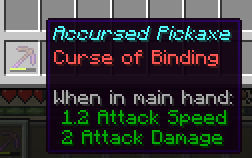

# Curse of Binding: Hotbar Edition
*AKA Bound Hotbar*

## Usage
Apply Curse of Binding to tools/armor, put it in your hotbar.
Now it's stuck there until you die!

The mod disables throwing via keybind for these cursed items,
although you can still swap cursed items between the off-hand
(which has also been cursed in the same manner),
so while you can move cursed items around (on the hotbar/off-hand),
you still can't take them off your person.

## License

This template is available under the CC0 license. Feel free to learn from it and incorporate it in your own projects.
